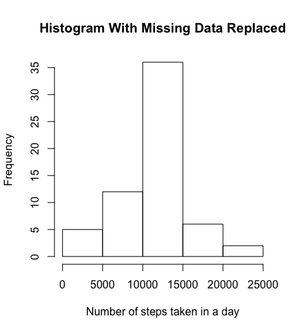
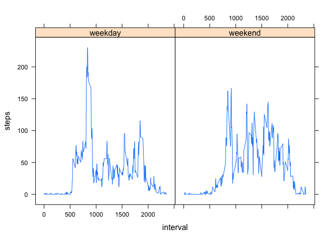

# Reproducible Research: Peer Assessment 1

This document will describe the process of loading data on the number of steps someone took each day for two months from a file, calculating some metrics to summarize the data and displaying some plots to explore the data.

## Loading and preprocessing the data

First, the data is loaded into R from a zipped file in the working directory. Then, the elements in the "date" column are changed to the "Date" class.


```r
data <- read.csv(unz("activity.zip", "activity.csv"))
data[2] <- lapply(data[2], as.Date)
```

## What is mean total number of steps taken per day?

We begin analyzing the data by plotting a histogram of the number of steps taken each day that includes the missing values. 


```r
steps_per_day <- tapply(data$steps, data$date, sum, na.rm=FALSE)

hist(steps_per_day, xlab="Number of steps taken in a day", main="Histogram of # of Steps Taken Each Day")
```

 

The mean number of steps taken each day is


```r
mean(steps_per_day, na.rm=TRUE)
```

```
## [1] 10766.19
```

The median number of steps taken each day is


```r
median(steps_per_day, na.rm=TRUE)
```

```
## [1] 10765
```

## What is the average daily activity pattern?

Here's a time series plot of the average number of steps taken across a day.


```r
daily_activity <- aggregate(steps ~ interval, data=data, mean)

plot(daily_activity, type='l', xlab="time interval", main="Average Daily Pattern of Steps")
```

 

The 5 minute interval that contains the most steps taken on average across all days is


```r
daily_activity[which.max(daily_activity[,2]),1]
```

```
## [1] 835
```

## Imputing missing values

The total number of rows in the original data that have missing values is


```r
total_rows <- dim(data)[1]
total_complete_rows <- sum(complete.cases(data))
total_rows - total_complete_rows
```

```
## [1] 2304
```

The following code will create a new dataset where the missing values in the original data are replaced with the mean for their 5-minute interval, calculated above.


```r
complete_data <- data
for(i in 1:dim(complete_data)[1]){
    if(is.na(complete_data[i,1])){
        j <- complete_data[i,3]
        complete_data[i,1]=daily_activity[daily_activity$interval %in% j,][2]
    }   
}

steps_per_day <- tapply(complete_data$steps, complete_data$date, sum)

hist(steps_per_day, xlab="Number of steps taken in a day", main="Histogram With Missing Data Replaced")
```

 

Now the mean number of steps per day is


```r
mean(steps_per_day)
```

```
## [1] 10766.19
```

and the median number of steps is


```r
median(steps_per_day)
```

```
## [1] 10766.19
```

The mean remains the same, which is not too surprising because the mean for each interval was used to replace the missing values. However, the median has shifted slightly because the total number of steps per day is different for days that previously had NA values.

## Are there differences in activity patterns between weekdays and weekends?

Here, we continue using the complete dataset with missing value replaced and add another column with a factor variable that says whether a given day is a weekday or a weekend day.


```r
library(dplyr)
```

```
## 
## Attaching package: 'dplyr'
## 
## The following object is masked from 'package:stats':
## 
##     filter
## 
## The following objects are masked from 'package:base':
## 
##     intersect, setdiff, setequal, union
```

```r
library(chron)
data_with_day_type <- mutate(complete_data, day=ifelse(is.weekend(date),"weekend","weekday"))
```

This panel plot shows a time series plot averaged over the 5-minute intervals for all weekdays and all weekend days.


```r
library(lattice)

daily_activity_weekday <- cbind(aggregate(steps ~ interval, data=subset(data_with_day_type, subset=data_with_day_type$day=="weekday"), mean), day="weekday")

daily_activity_weekend <- cbind(aggregate(steps ~ interval, data=subset(data_with_day_type, subset=data_with_day_type$day=="weekend"), mean), day="weekend")

total = rbind(daily_activity_weekday, daily_activity_weekend)

xyplot(steps ~ interval | day, data=total, type="l")
```

 
