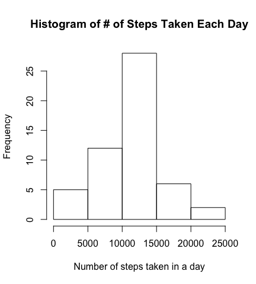
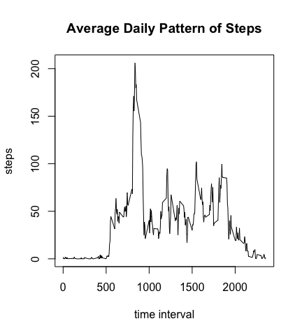

# Reproducible Research: Peer Assessment 1

This document will describe the process of loading data on the number of steps someone took each day for two months from a file, calculating some metrics to summarize the data and displaying some plots to explore the data.

## Loading and preprocessing the data

First, the data is loaded into R from a zipped file in the working directory.


```r
data <- read.csv(unz("activity.zip", "activity.csv"))
```

## What is mean total number of steps taken per day?

We begin analyzing the data by plotting a histogram of the number of steps taken each day that includes the missing values. 


```r
steps_per_day <- tapply(data$steps, data$date, sum, na.rm=FALSE)

hist(steps_per_day, xlab="Number of steps taken in a day", main="Histogram of # of Steps Taken Each Day")
```

 

The mean number of steps taken each day is


```r
mean(steps_per_day, na.rm=TRUE)
```

```
## [1] 10766.19
```

The median number of steps taken each day is


```r
median(steps_per_day, na.rm=TRUE)
```

```
## [1] 10765
```

## What is the average daily activity pattern?

Here's a time series plot of the average number of steps taken across a day.


```r
daily_activity <- aggregate(steps ~ interval, data=data, mean)

plot(daily_activity, type='l', xlab="minute", main="Average Daily Pattern of Steps")
```

 

The 5 minute interval that contains the most steps taken on average across all days is


```r
daily_activity[which.max(daily_activity[,2]),1]
```

```
## [1] 835
```

## Imputing missing values

The total number of rows with missing values is


## Are there differences in activity patterns between weekdays and weekends?
